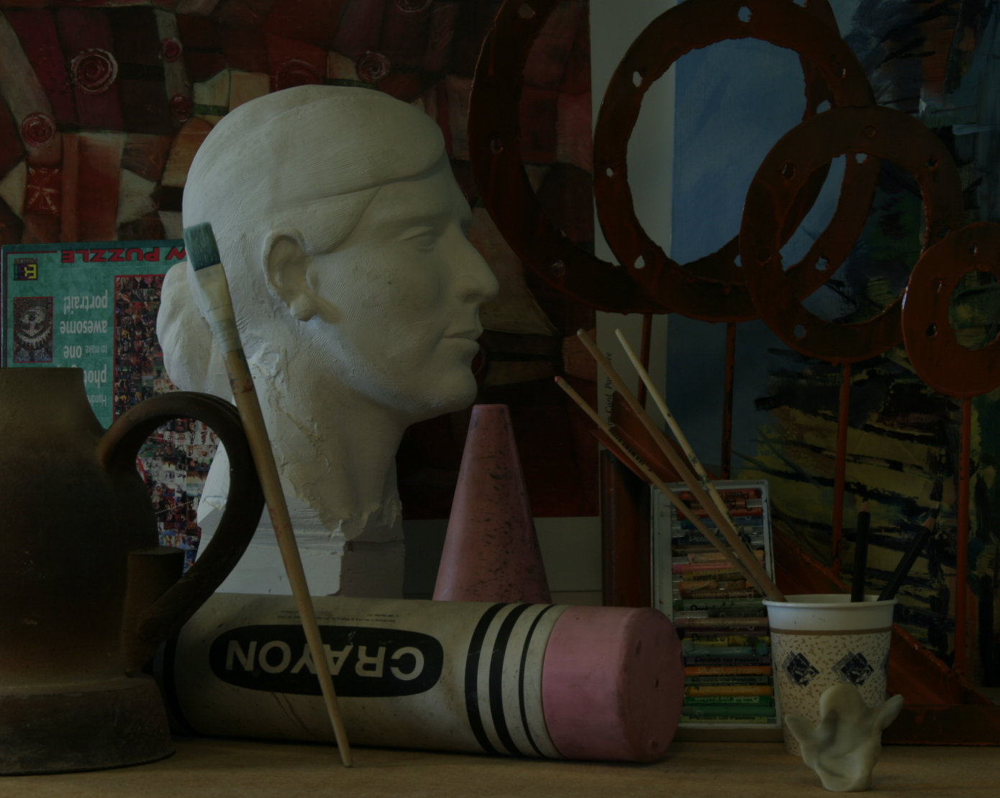
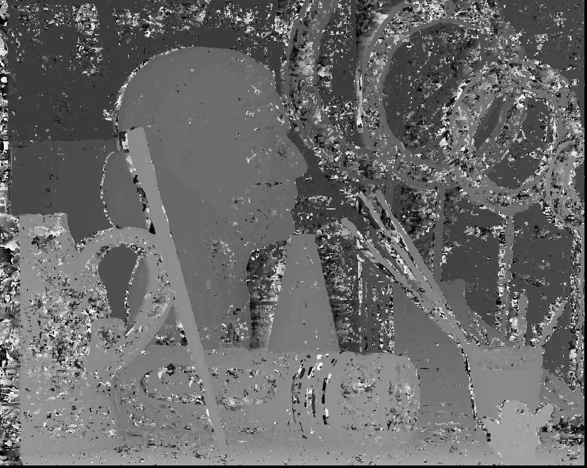
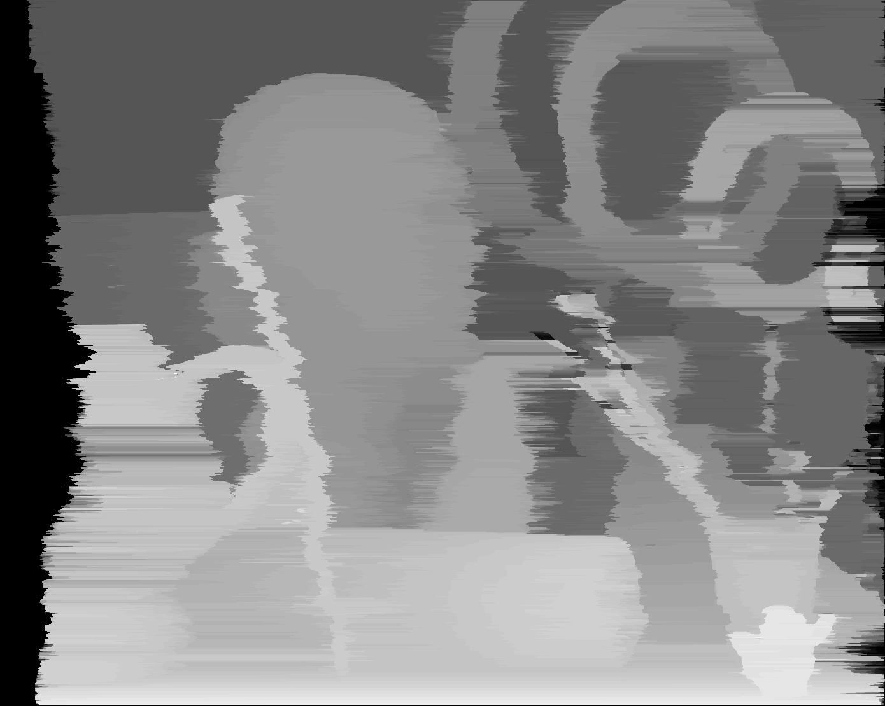

# Stereo Estimation

Project for the course 3D Sensing and Sensor Fusion at Eötvös Loránd University.

* Naive and dynamic programming stereo matching schemes
* 3D point cloud generation from disparities. 
 
### Input images:

view 0 | view 1
--- | ---
 | 
 
### Output images:

#### Naive approach

 
#### Dynamic Programming approach

